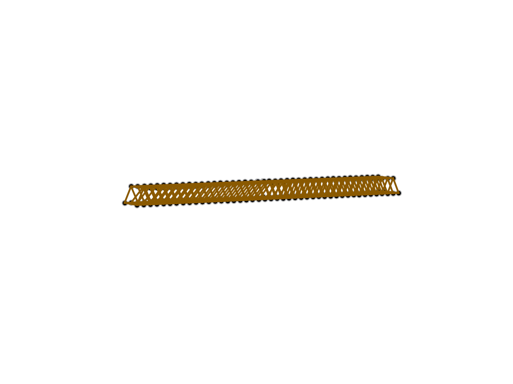
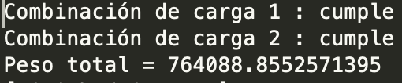
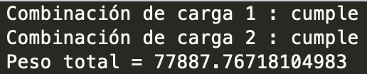
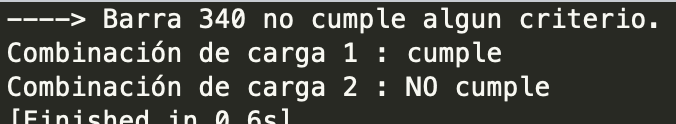
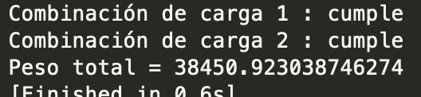

El primer diseño es un puente con arco bajo el tablero. Este tablero que tiene un largo total de 215 metros, se dividió en tramos de 5 metros, obteniendo un total de 43 tramos.

Este diseño no se pudo comprobar, por lo que fue cambiado.

En segundo lugar, se realizo el siguiente diseño:

El cual es un puente con perfil cajon. Inicialmente, el diseño se realizó con un radio igual a 8 cm y un espesor de 5 mm, cumpliendo con ambos casos.

Para optimizar el peso, se disminuyó el radio a 4 cm y el espesor a 1 mm, volviendo a cumplir con los 2 casos.

Luego, se volvió a disminuir el radio, esta vez dejandolo en 1 cm, y este no cumplió con el caso 2.

Finalmente, llegamos a que al aumentar el radio a 2 cm, el diseño si cumplia con ambos casos.

