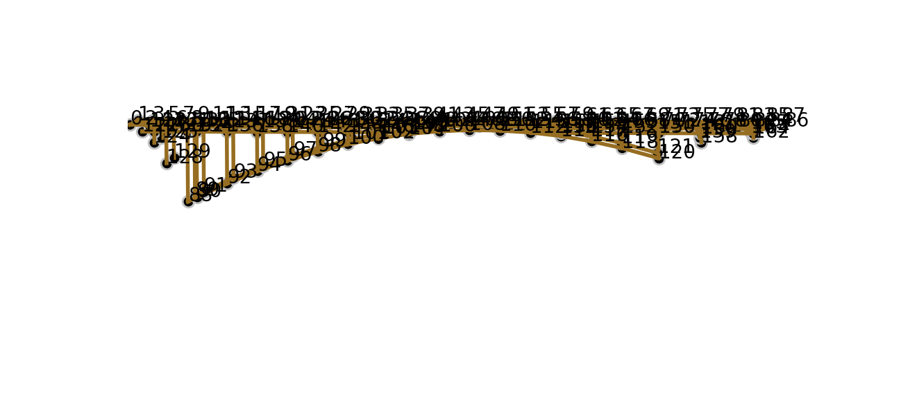

# MCOC2020_P2_G7_Entrega5

El primer diseño es un puente con arco bajo el tablero. Este tablero que tiene un largo total de 215 metros, se dividió en tramos de 5 metros, obteniendo un total de 43 tramos.

Este diseño no se pudo comprobar, por lo que fue cambiado.
